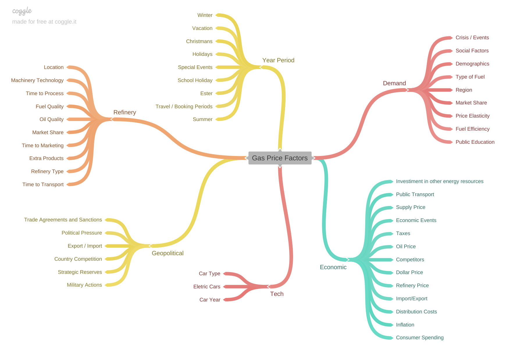
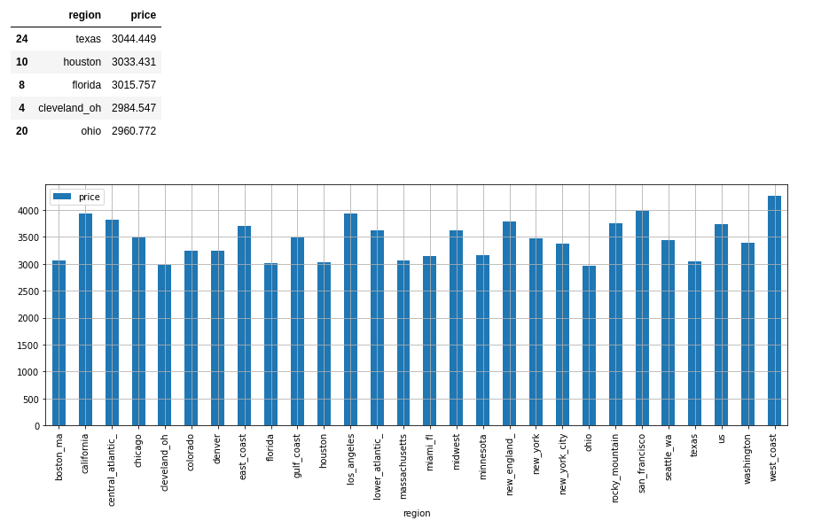

# Gas Price Forecast

---

---

### Summary

- [1.0. Business Problem](#10-bussiness-problem)
- [2.0. Solution Strategy](#20-solution-strategy)
  - [2.1. The Mind Map](#21-the-mind-map)
  - [2.2. Problem Solving Methodology](#22-problem-solving-methodology)
  - [2.3. The Workflow](#23-the-workflow)
- [3.0. Exploratory Data Analysis](#30-exploratory-data-analysis)
  - [3.1. Top 2 Hypothesis](#31-top-2-hypothesis)
- [4.0. Machine Learning](#40-machine-learning)
- [5.0. Next Steps](#50-next-steps)

---

## 1.0. Business Problem

**Business Overview**: You work at Trucks Inc. Your company with a marketplace business model, the company brings together Self-Employed Truck Drivers and Third Party Truck Drivers with other companies that need a truck driver to move all types of materials, such as gasoline, food (processed or not, for example, frozen meat, forzen fruits, cotton, wheat, seasonings, drinks of all types and so on) all these products are requested by companies that need a truck driver. One side of the marketplace are companies, they all need to create an account with valid credentials and request a driver for specific locations, risk, time range to complete, intervals, priority and the company can price the trip reward or not, to all positions. of travel, Trucks Inc receives a per postage a fee. On the other side of the marketplace are self-employed truck drivers or third-party drivers, everyone also needs to create a truck driver account and find all the trips available for them to join, after the truck driver choise the traveling, the Truck Inc make a Interview with Driver and Third Company for validate the traveling and completes the process of marketplace.

**Business Problem**: At Trucks Inc, you need to expand the marketing campaign to acquire new self-employed truck drivers, one of the hypotheses raised by the Head of Marketing was to use the price of gasoline as an incentive to attract the attention of truck drivers, as the company has a lot of trips in progress. currently open but there are around 50% of active truck drivers on the platform, so the Head of Marketing has a proposal to pay 50% of the fuel needed for the truck driver's trip if he completes a trip on the platform. In this scenario, you need to forecast the gas price for all regions and give a statistics overview of all available regions based on gas price for for Head of Marketing decisions.

## 2.0. Solution Strategy

---

### 2.1. The Mind Map
For this perspective of business problem, exists some factors or exog features can be affect gas price, in this context, the first thing I have done is a mind map to map and derive hypothesis for validate on EDA step.

### 2.2. Problem Solving Methodology
I have CRISP in my toolkit for rapid development of solutions and problem solving techniques, based on this, the author "Eric Ries" has a phrase in the book lean startup, "Vision leads to direction" and shows a cyclical process for startup fast projects solutions and can be applied to data science projects too!!!

### 2.3. The Workflow
My Databricks Notebook ML Published: https://databricks-prod-cloudfront.cloud.databricks.com/public/4027ec902e239c93eaaa8714f173bcfc/8344051579127702/733971477183930/5729498605416871/latest.html

For this project I have developed a workflow for gas price forecast, from source to query. The data source is a US Gov available dataset from this link: "https://www.eia.gov/petroleum/gasdiesel". I have takend this source and make a process for monthly extraction and save on landing object in Aws s3.
After the file is in landing, i used delta lake to build a lakehouse multi-hop architecture, all using databricks with spark and aws s3 for delta files and athena for query in delta files inside a data lakehouse, from databricks I used a ML Cluster for machine learning, mlflow, nixtla and spark with all delta jars, and with aws i have selected terraform for IAC tool for fast build all buckets, glue crawler and database for athena serving layer, all is visible on this image below:

You can use Aws glue jobs instead of Databricks for delta files, but you need to configure jars, connections and glue jobs and the machine learning plataform from zero if you like to use mlflow, hyperopt, sql warehouse, autoloader, delta sharing... istead of sagemaker and aws solutions. For this reason I selected databricks as platform for lakehouse and aws for *storage* and *serving*.

The main ideia is use this architecture for external variables in future too, and the machine learning I used silver layer because is clean dataset and the inference is in one big table in gold layer because i can have other gold layer can use the same dataset without forecast for validate another business problem, but I can use gold table for machine learning train and save in another gold table... 

For Aws you can create Delta Connection by hand using aws marketplace: 

1. Create Marketplace Delta Lake connection and Configure with default options for connector and you need to provide a VPC, Subnets and SG, can be used default or created with TF.
2. Create Database on AWS Glue for Store Crawler Metadata.
3. Create a Crawler to analyse Delta Tables (Provide Path of All Tables!).
4. The Crawler will save the schema and metadata of the Delta Table on AWS Glue Database (created on 3.).
5. Query on Athena!!!

## 3.0. Exploratory Data Analysis

---

This is a very cool step in data science projects, I divide the EDA into three steps, univariable, bivariable and multivariable steps, In the univariable I check the target and all the characteristics (categorical and numerical) if exists, In the Bivariable, this step I validate Business Hypothesis and check seasonal plots, finally in the Multivariable it is the correlations and the pair diagrams for check behaviors of all features.

List to Validate:

1. The total price of gas increased more then 50% compared to the previous year.
2. The total price of gas increase more than 10% in last two quarters on year.
3. The region Ohio have gas price 2x more expensive than other regions.
4. The last days of months, the gas price have a increase of 5x compared to days of start of month.
5. The total price of gas have 2x spikes in "some" lat log locations.

### 3.1. Top 2 Hypothesis

---

**Number: 2. The total price of gas increase more than 10% in last two quarters on year.** is False based on Plots, you can see looks like the same behavior on different quarters, but quarter 2 and 3 looks like a very small difference, is i like to use a *statistical inference test of means* for validate the hypothesis, I will need to validade in all regions individually and split the gas on control and validate groups, is very hard to do in real life. 

Total Price by Quarter

Quarter Price Means

**Number: 3. The region Ohio have gas price 2x more expensive than other regions.** is False based on Plots, but is possible to see, the best region for buy gas is Ohio, the price is the small of all regions, but i need to have a better analisys of this hypothesis, for example compare different periods and check if this price is small in all months, for example, in Statistical Description, the small price observed in dataset is for region "midwest", but, the std is higher, I made below a simple stats table for checkout this two states.

| region      | std  | min  | 25%  | 50%  | 75%  | max  |
| ----------- | ---- | ---- | ---- | ---- | ---- | ---- |
| ohio        | 0.86 | 0.92 | 1.35 | 2.16 | 2.87 | 4.71 |
| midwest     | *0.92* | 0.89 | 1.40 | 2.26 | 2.97 | 5.04 |

## 4.0. Machine Learning

---

For forecast, i used nixtla for multiple regions gas forecast, the best statistical method fitted is CES based on train and test, but is very danger to use train test in time series because the best model fit on train but for last fit (fit estimator using train and test for future forecast) the estimator cannot be the "best" given more variations introduced on dataset, I not used time series cross validation because its all builted in first cycle for this solution, in next cycles i will use other models such xgboost, and other statistical methods and make a cross valiadion for really find the best inference model, is the next steps!

But is possible to see a good seasonal behavior on sliced dataset with peaks closer to month 11, maybe a exog cyclic feature can do a better fit instead using only price variations, but i not used exog features in the first cycle, only for simple tests.

The Mlflow is the tool used for log, monitore and register models for inference on gold layer, i log results for baseline models such as mean and seasonal naive, and log metrics for statsforecast estimators too.

For tuning, i only selected one feature, is the "seasonal length", maybe this param is not used for tuning because is the cyclic behavior of dataset, in this case 7 days (weekly), but, the best seasonal length for this dataset i have finded is 24, I have fitted more than 50 estimators for find best estimator given a set of four estimators from statsforecast (AutoARIMA, AutoCES, AutoETS and AutoTheta) and the only tuned param is "season length", in this image below, is the best estimator finded after fits, using train test dataset.

## 5.0. Next Steps

---

1. Time Series Cross Val, is important!
2. Test Exog Features.
3. Explore more the validated hypothesis.
4. Fix and validate new terraform deployments.
5. Test external features (build bronze, silver and gold workflows and test on inference).